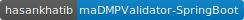

# maDMP Validator - Spring Boot Version
Based on [Validating-machine-actionable-DMP](https://github.com/hertai86/Validating-machine-actionable-DMP), but with advanced back-end functionalities. This tool checks whether machine-actionable dmps conform to rda dmp common standard, and check maDMPs for specific vocabularies determined by the on who will use this tool.

Supported vocabulary files are listed in [Configure maDMP Vocabulary](https://github.com/HasanKhatib/maDMPValidator-SpringBoot#configure-madmp-vocabulary) section.

## Getting started with `maDMP Validator Pro`
This tool was developed using spring-boot with Kotlin as a backend language. With that said, you will be able to run it on the go, just make sure that you have the minimal requirements in the Prerequisites section.

### Prerequisites
- Java 8+
- Maven 3+ (If you are working with intellij, then it will be there)

Thats all :)

### How to run it?
Start by cloning this repository to your machine (`git clone https://github.com/HasanKhatib/maDMPValidator-SpringBoot.git`).
Then use the next maven command in the project directory:
`mvn spring-boot:run`

Now, go to http://localhost:8080/

### Configure maDMP vocabulary
This directory `/maDMPValidator-SpringBoot/src/main/resources/vocabs/dmp-dataset-type.txt` has the vocabulary files named after the entity that will be checked. You can update each file to check the maDMP against your own vocabulary and allowed values.

#### Supported fields for vocab validation:
- **Certificats** for Dataset distribution hosts
- **GeoLocation** for Dataset distribution hosts
- **Types** for datasets
- **Funding** status for DMP projects

* The next screenshot shows the GeoLocations Allowed for datasets distribtion hosts:

## License
MIT License

Copyright (c) 2019 Hasan Alkhatib

Permission is hereby granted, free of charge, to any person obtaining a copy of this software and associated documentation files (the "Software"), to deal in the Software without restriction, including without limitation the rights
to use, copy, modify, merge, publish, distribute, sublicense, and/or sell copies of the Software, and to permit persons to whom the Software is furnished to do so, subject to the following conditions:

The above copyright notice and this permission notice shall be included in all copies or substantial portions of the Software.

THE SOFTWARE IS PROVIDED "AS IS", WITHOUT WARRANTY OF ANY KIND, EXPRESS OR IMPLIED, INCLUDING BUT NOT LIMITED TO THE WARRANTIES OF MERCHANTABILITY, FITNESS FOR A PARTICULAR PURPOSE AND NONINFRINGEMENT.

IN NO EVENT SHALL THE AUTHORS OR COPYRIGHT HOLDERS BE LIABLE FOR ANY CLAIM, DAMAGES OR OTHER LIABILITY, WHETHER IN AN ACTION OF CONTRACT, TORT OR OTHERWISE, ARISING FROM, OUT OF OR IN CONNECTION WITH THE SOFTWARE OR THE USE OR OTHER DEALINGS IN THE SOFTWARE.
